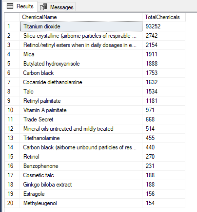
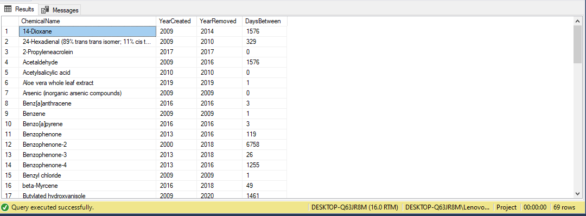

## Chemicals-In-Cosmetics: What's On Your Face and Body!!
In a world where beauty trends are constantly changing, it’s important to have a deeper understanding of the ingredients/chemicals in the products we use daily. In this project, I will explore the fascinating world of cosmetics, looking at the chemicals compositions that make each product and uncovering insights that help us understand their effects better, gain valuable knowledge to make informed decisions about our skincare and beauty routines. 

Cosmetics have been an integral part of human culture for millennia, dating back to ancient civilizations. However, the formulations and ingredients have evolved significantly over time, incorporating a diverse array of chemicals to achieve desired effects. Each products category from skincare products, baby products, fragrances, makeup products, hair-care products to oral hygiene products contains a complex blend of substances carefully selected for their properties. 

## About Dataset  
The dataset was downloaded from [Kaggle](https://www.kaggle.com/datasets/thedevastator/chemicals-in-cosmetics-what-s-really-in-your) 

The dataset provides comprehensive information about cosmetic products from the California Department of Public Health (CDPH), including details such as product names, companies, brands, primary and sub-categories, and chemical compositions. It contains internal identification numbers for products, companies, categories, sub-categories, and chemicals as well as Chemical Abstracts Services (CAS) numbers for the chemicals. Additionally, the dataset includes dates related to the reporting, creation, updating and removal of chemicals from products, as well as the date when a chemical was discontinued.  

With 114,299 rows and 23 columns, this dataset offers a detailed perspective on the cosmetics industries, facilitating analysis of chemical usage, product formulations and regulatory compliance. 

I used Microsoft SQL Server, with SQL Server Management Studio (SSMS) as the integrated development environment (IDE) for querying and managing the database.

## Project Goal/Questions
The main goal of this project is to explore various aspects of the dataset, including product distribution, chemical usage and company practices, providing insights into the landscape of cosmetics and their chemical compositions. In order to achieve this goal, I will be answering the following relevant questions. 

1) How many unique chemicals are reported in the dataset, and what is their distribution across differnt Product?
2) What is the distribution of Products across different Primary categories and sub-categories?
3) Which Brands had chemicals that were removed and discontinued and identify the chemicals?
4) Which companies used the most reported chemicals in their cosmetics and personal care products?
5) Find out which chemicals were used the most?
6) Which Products have been reported to contain the highest number of chemicals?
7) Can you identify the period between the creation of the removed chemicals and when they were actually removed?
8) Have there been any Products that were later discontinued, if applicable, the Brand and date the Product was discontinued?
9) Identify the relationship between CSF and chemicals used in the most manufactured subcategories?

## Observations 
- There are total of 112 unique chemicals reported in this dataset. 
- 33,361 reported products and 587 unique company in the dataset.

## Data Cleaning 
1) Converted Date Columns From  DateTime Format to Just Date Format:
 
 - InitialDateReported
 - MostRecentDateReported
 - DiscountinuedDate
 - ChemicalCreatedAt
 - ChemicalUpdatedAt
 - ChemicalDateRemoved

2) Standardizing Columns, Corrected and replaced Variations in Names Due to Different Spellings, Replacing punctuations and special symbols like (',', '-','.', '�' replacing them with '') and Capitalizing first letters in each column:
   
 - ProductName
 - CompanyName
 - BrandName
 - ChemicalName
 - CSF
   
4) Viewing Duplicate rows, but i don't want to drop them.
   
5) Dropping Unnecccessary Columns like CompanyId, SubCategoryId, CasId, CasNumber

6) The dataset table consists of 23 columns, but I am only interested in examining the following columns:

  - CDPHId (The California Department of Public Health Internal Identification Number for Product)
  - ProductName
  - CSF (Refers to Color/Scent/Flavor)
  - CompanyName
  - BrandName
  - PrimaryCtegory
  - SubCategory
  - ChemicalName
  - InitialDateReported
  - MostRecentDateReported
  - DiscountinuedDate
  - ChemicalCreatedAt
  - ChemicalUpdatedAt
  - ChemicalDateRemoved

## Mostly Used Chemicals in Cosmetic Products

   
## Harmful Chemicals

- According to Word Health Organization's list of chemicals of major concerns combined with Campaign for Safe Cosmetics includes Coal Tar, Mica, Carbon Black, 14-Dioxane, Titanium Dioxide, Toluene, Talc etc. Heavy metals like Lead, Arsenic, Mercury, Cadmium, Chromium. These chemicals can cause immediate irritation ans some other effects even with low amount of exposure. For more details on the top chemicals of major concerns, please visit this link [Campaign for Safe Cosmetics](https://www.safecosmetics.org)
